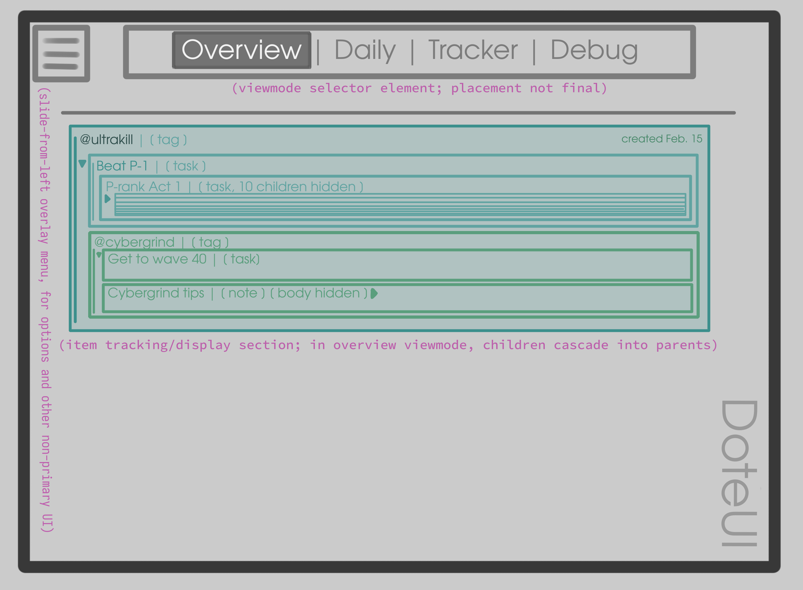

# Doteui client notes

## Design

Doteui is a "single page application" (though without any client-side routing) where page elements are dynamically generated on demand using client-side Javascript.
It's designed to be used on both desktop and touch screen interfaces.

### Viewmodes

Doteui displays user data in different **viewmodes**, selectable via big, obvious, primary UI element.
**Viewmodes** organize, sort, and present the user's data to them in varying formats: one viewmode could organize and sort the user's items by tag, while another might organize them by priority determined by due date.
Viewmodes can have entirely different layouts and designs, too--for example, a calendar view that displays items on their due dates.
Each viewmode has a client-visible name and (not client-visible) render function, allowing users to add their own custom viewmodes if they so desire.

#### Viewmode list

`overview`: renders tree sorted by top-level tags. Ideal for seeing the state of all your projects at a glance.
`debug`: Prints and prettifies the user's JSON datafile directly onto the webpage. For debug purposes.

### Rendering items and the item tree

*See `data.md` for information on how Dote items are structured.*

When items with children are displayed (and Doteui is in a viewmode that displayes items in a list format), items with children are rendered in a "cascading list" style, where each item can be minimized, hiding its children.
